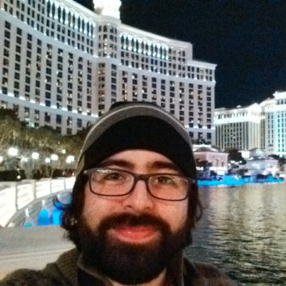

---
# You don't need to edit this file, it's empty on purpose.
# Edit theme's home layout instead if you wanna make some changes
# See: https://jekyllrb.com/docs/themes/#overriding-theme-defaults
layout: default
---

I'm Antonio and I'm a Software Developer from Venezuela, currently located in Munich, Germany.

I like to tinker in [several open source projects](./projects/projects.md).

I'm a huge fan of [vim][vim] (also [neovim][neovim]) and Linux. My current distro of choice is [Arch Linux][archlinux]. I'm also starting to grow fond of the [go][golang] programming language.

In this blog I [write](./posts) about my interests: machine learning, artificial intelligence, data science, software development, Linux, and things that I've learned along the way.

[vim]: https://www.vim.org
[neovim]: https://neovim.io
[archlinux]: https://www.archlinux.org/
[golang]: https://golang.org/
